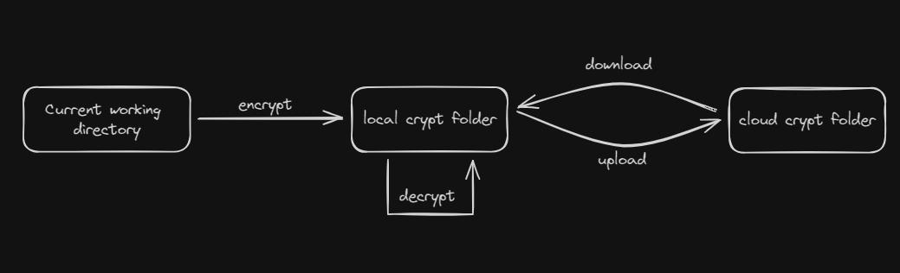

<p align="center">

<h1 align="center">ByteCrypt</h1>
</p>
<br/>

[](https://crates.io/crates/ByteCrypt)
[](https://docs.rs/ByteCrypt)
[](https://github.com/ExtremelyRyan/ByteCrypt/actions)
 
Encryption command line application on single file or entire directories.

<h2 align="center"><FONT COLOR="RED">CAUTION </FONT></h2>
<h3>this is very much a <b>work in progress</b>, and is undergoing rapid development that may break between commits.</h3>

## What is ByteCrypt?

ByteCrypt came about because I wanted the conveience of using all of the popular cloud file storage options, without the worry of storing my documents that contained PII (personally identifiable information). 

I also wanted a way for people who are not adept in encryption, computers, etc. to be able to get a simple program that they can use as a additional layer of security to protect their most senitive files, while maintaining ease of use.

### Encryption
ByteCrypt uses [chacha20poly1305](https://en.wikipedia.org/wiki/ChaCha20-Poly1305) ([RFC 8439](https://datatracker.ietf.org/doc/html/rfc8439)) for it's encryption, using 256-bit keys and a unique 96-bit nonce for every file.

### Compression
file size can quickly get out of hand, especially when you are backing up to the cloud. That's why we use [Zstandard](https://en.wikipedia.org/wiki/Zstd) to compress files before encryption.

You can configure your level of compression from the configuration file.

## Getting Started

### Getting Google Service Account

Becuase this is a public source repository, we are unable to place our `client ID` and `client secret` in the repo. because of this, you will have to go out and create a service account (free) to enable ByteCrypt access to use your Google Drive. 

[service account instructions](https://developers.google.com/identity/protocols/oauth2/service-account#creatinganaccount)

after following the instructions, please download the json file (named `google.json` !) to: <br>

Windows: `C:/Users/USER/crypt_config/.config/google.json` <br>

Linux: `~/home/USER/crypt_config/.config/google.json`

### Dependencies

currently being tested on windows 10,11, wsl(ubuntu), and Arch linux.
requires minimum Rust version > 1.70.

### Installing
* Install the rust toolchain in order to have cargo installed by following
  [this](https://www.rust-lang.org/tools/install) guide.
* go to our [release](https://github.com/ExtremelyRyan/ByteCrypt/releases) page and download the latest 
* Clone the repository, and go to the root project directory. Run `cargo install --path .`


### Basic premise
In the spirit of the [KISS principle](https://en.wikipedia.org/wiki/KISS_principle), this is our overall design for ByteCrypt.

no matter where you are in your file directory, you can always quickly encrypt, decrypt files as needed.

### Basic Commands

for the full list, please see `Commands.md`.

#### Encrypt

no matter where you are in your file system, encrypting a file or folder is as easy as:
```bash
crypt encrypt ./important_documents # folder and all contents, including sub-directories
crypt encrypt tax_return.pdf        # single file
``` 

Your encrypted version of those folders / files will appear in your local crypt folder. to quickly see what files you have in your crypt folder, simply `crypt ls`

```txt 
C:\Users\Ryan\crypt
└── dracula.crypt
```

#### Decrypt

Decryption works slightly different than `encrypt`. Decrypt is <b>only</b> looking at your crypt folder, since that is where the `*.crypt` files will live.

Running `crypt decrypt` will bring up the chooser™, which looks something like this:

```text
please choose from the following: (or 0 to abort)
#   files                                         last modified 
----------------------------------------------------------------
1   \dracula.crypt                                01/15/24 21:12
2   \some\folder\dracula.crypt                    01/15/24 21:15
----------------------------------------------------------------

#   folders
----------------------------------------------------------------
3   \crypt
4   \crypt\some
5   \crypt\some\folder
```

Simply select your file or folder and we will take care of the rest.

all decrypted files will end up in `crypt/decrypted`

```
C:\Users\Ryan\crypt
├── decrypted
│   └── dracula.txt
...
```


#### Config

want more compression? want to change the crypt folder path? no problem. use `crypt config` to change the defaults.
```txt
config
    database-path, -d  View or update the database path
    crypt-path,    -c  View or update the crypt folder path
    ignore-items,  -i  View or change which directories and/or filetypes are to be ignored
    hwid               View or change current pc name associated with the cloud
    zstd-level,    -z  View or change the compression level (-7 to 22) higher is more compression
    load-default,  -l  Revert config back to default
```

#### Upload
google upload for both files and folders is mostly completed. ensure you follow the google setup instuctions prior to trying upload.

#### Download
also a work in progress!

 
## Authors 
Creator Ryan M - Twitter [@Extremely_Ryan](https://twitter.com/Extremely_Ryan)


Core Contruibutor: [Josh](https://github.com/JoshBenn)


email: <thebytecrypt@gmail.com>

## Version History

still working on it!

## License

This project is licensed under the [MIT] License - see the LICENSE.md file for details

## Acknowledgments

Inspiration, code snippets, etc.
* [awesome-readme](https://github.com/matiassingers/awesome-readme) 
